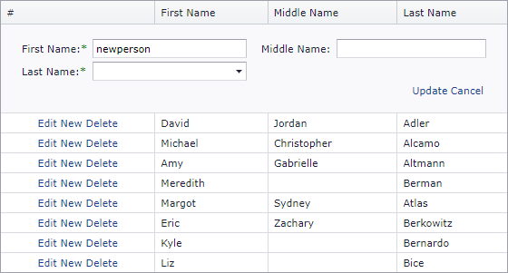

<!-- default badges list -->

[](https://supportcenter.devexpress.com/ticket/details/E4825)
[](https://docs.devexpress.com/GeneralInformation/403183)
<!-- default badges end -->

# Grid View for ASP.NET MVC - How to change an editor's type based on another editor's value
<!-- run online -->
**[[Run Online]](https://codecentral.devexpress.com/e4825/)**
<!-- run online end -->

This example demonstrates how to change the editor type for a certain field based on the value of another editor in the edit form. 



## Implementation Details

In this example, the type of `LastName` column editor changes from _textbox_ to _combobox_ when the `FirstName` editor value equals `newperson`.

```jscript
function onTextChanged(s, e) {
    if (s.GetText() == 'newperson') {
        cbEdit.SetVisible(true);
        txtEdit.SetVisible(false);
    } else {
        cbEdit.SetVisible(false);
        txtEdit.SetVisible(true);
    }
}
```

It is impossible to bind two editors placed on one form to the same field (in this case, their `Name` property will be equal, which is forbidden). This is why a hidden field is used to store values and transfer them to the server.

```jscript
function ChangeHiddenValue(s, e) { 
    var hidden = document.getElementById('LastName');
    hidden.value = cbEdit.GetVisible() ? cbEdit.GetText() : txtEdit.GetText();
}
```

## Files to Review

* [MyScript.js](./CS/WebSite/Scripts/MyScript.js) (VB: [MyScript.js](./VB/WebSite/Scripts/MyScript.js))
* [GridViewPartial.cshtml](./CS/WebSite/Views/Home/GridViewPartial.cshtml)
* [Index.cshtml](./CS/WebSite/Views/Home/Index.cshtml)
